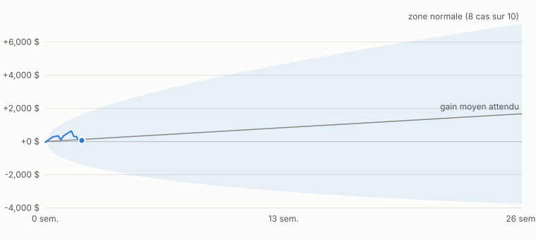
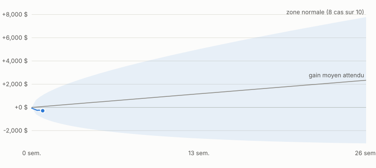

# Robot multi-marches : tableau de bord (argent virtuel)

Mis a jour le **2026-09-25**. Deux comptes virtuels de 50 000 $, risque vise 12 %/an (environ 6 000 $). Aucun argent reel n'est engage.

| Compte | Solde | Gain | Etat |
|---|---|---|---|
| Tendance seule | 49,958 $ | -42 $ | ⚪ Trop tot pour juger |
| Melange 50/50 (tendance + achat permanent) | 49,938 $ | -62 $ | ⚪ Trop tot pour juger |

La zone bleue de chaque graphique montre ou tombaient 8 resultats sur 10 dans l'historique 2007-2026, au meme risque. Tant que la ligne reste dedans, le compte se comporte comme prevu. Des semaines negatives sont normales : il faut plusieurs mois pour juger.

## Tendance seule

Demarre le 2026-09-25. Historique 2007-2026 au meme risque : Sharpe 0,56, environ +7 %/an en moyenne, pire baisse -23 %, 13 annees sur 20 positives.

**⚪ Trop tot pour juger : le compte vient de demarrer.**

| Mesure | Valeur |
|---|---|
| Solde virtuel | **49,958 $** (depart 50 000 $) |
| Gain depuis le depart | -42 $ (-0.1%) |
| Baisse depuis le plus haut | -0.1% |
| Zone normale a ce stade (8 cas sur 10) | de +0 $ a +0 $ (moyenne +0 $) |
| Challenge Phidias 50K virtuel | en cours : -42 $ sur +4 000 $, marge restante 2,458 $ |

| Contrat | Marche | Sens | Nombre |
|---|---|---|---|
| MET | Ether | Achat | 5 |
| 10Y | Taux 10 ans | Achat | 4 |
| M2K | Russell 2000 | Achat | 1 |
| 2YY | Taux 2 ans | Achat | 1 |
| M6B | Livre sterling | Vente | 1 |
| MSF | Franc suisse | Vente | 1 |

10 derniers jours

| Date | Resultat du jour | Solde |
|---|---|---|
| 2026-09-25 | +0 $ | 49,958 $ |

Journal complet : [journal.csv](journal.csv)

## Melange 50/50 (tendance + achat permanent)

Demarre le 2026-09-25. Historique 2007-2026 au meme risque : Sharpe 0,78, environ +9 %/an en moyenne, pire baisse -19 %, 3 annees sur 4 positives.

**⚪ Trop tot pour juger : le compte vient de demarrer.**

| Mesure | Valeur |
|---|---|
| Solde virtuel | **49,938 $** (depart 50 000 $) |
| Gain depuis le depart | -62 $ (-0.1%) |
| Baisse depuis le plus haut | -0.1% |
| Zone normale a ce stade (8 cas sur 10) | de +0 $ a +0 $ (moyenne +0 $) |
| Challenge Phidias 50K virtuel | en cours : -62 $ sur +4 000 $, marge restante 2,438 $ |

| Contrat | Marche | Sens | Nombre |
|---|---|---|---|
| MET | Ether | Achat | 10 |
| MCD | Dollar canadien | Achat | 4 |
| 30Y | Taux 30 ans | Achat | 2 |
| MES | S&P 500 | Achat | 1 |
| 10Y | Taux 10 ans | Achat | 1 |
| M6A | Dollar australien | Vente | 1 |

10 derniers jours

| Date | Resultat du jour | Solde |
|---|---|---|
| 2026-09-25 | +0 $ | 49,938 $ |

Journal complet : [journal_melange.csv](journal_melange.csv)

Contrats de taux (2YY, 10Y, 30Y) : le sens indique est celui de l'ordre sur le contrat, inverse de celui des obligations. Methode et resultats historiques : [../README.md](../README.md).
